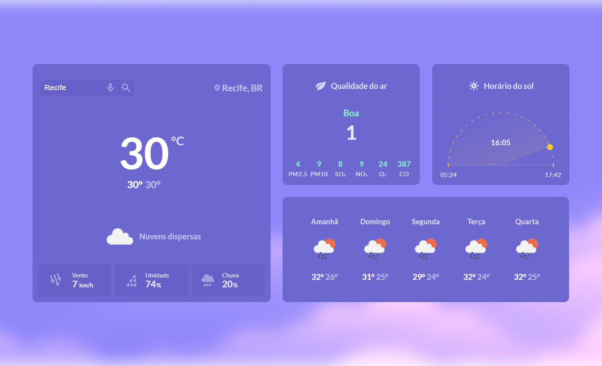
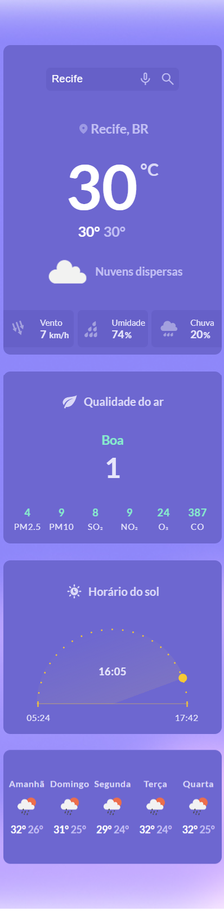

<h1 align='center'>Weather</h1>

A Weather application. In this app I am using HTML, CSS, JavaScript, SweetAlert 2, Moment.js and OpenWeather.

## Features Developed

- [x] Search a city and get weather informations
- [x] Voice search feature 
- [x] Getting the user's location
- [x] Wind speed, wind direction, humidity and rain
- [x] Air quality conditions
- [x] Local time, sunrise and sunset
- [x] Responsivity

## Screenshots

The interface

Mobile version

## Prototype

You can access the Rocketseat prototype by clicking the button below.

## Technologies

## Services Used

</a>

## Deploy

You can access the project by clicking the button below.

